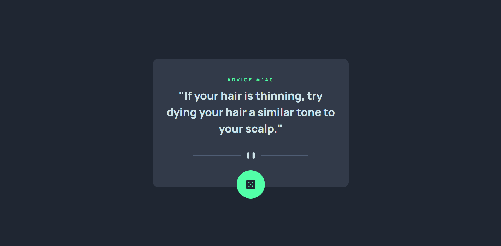

## Funny Advice Generator app

I know I said I dropped frontend, yes I did butt I thought it would be fun to learn React and know a bit of both frontend and backend so I can build my own cool stuff.

After taking a really great tutorial by BroCode on YouTube, I took on a task from Frontend Mentor to check out what I have learned.

I used ReactJS and got the advice data from **Advice Slip JSON API**. 🚀

I learnt how to use components in React and how to access JSON data from an API!

I'm very happy with the build even though it's so simple!

Check out live site here: https://your-live-site-url.com

**Hehehe!** 🚀
